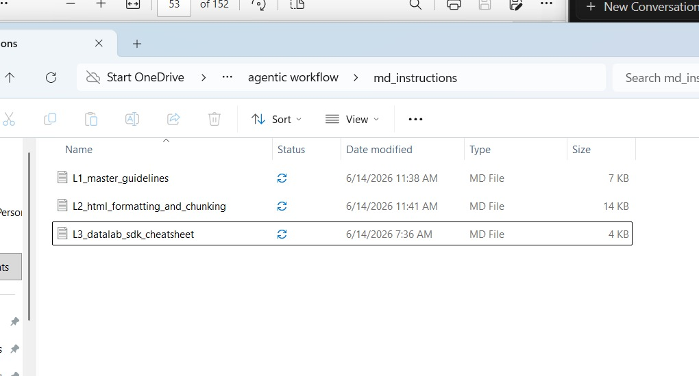
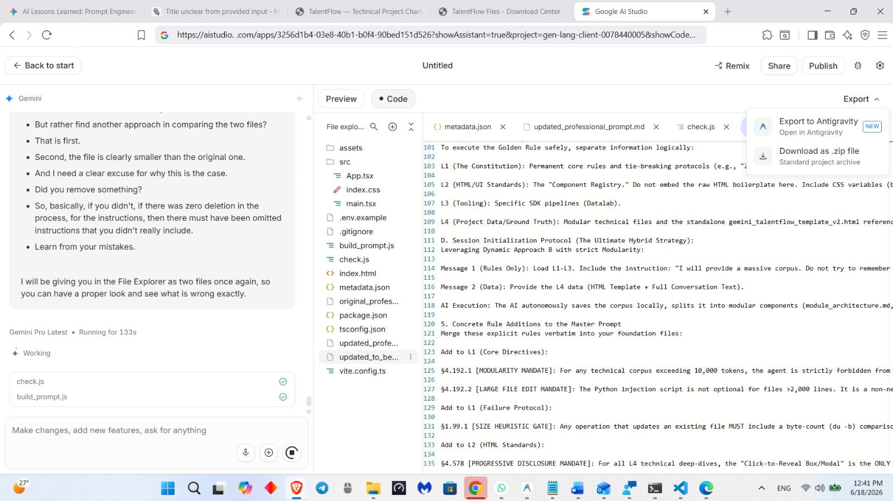
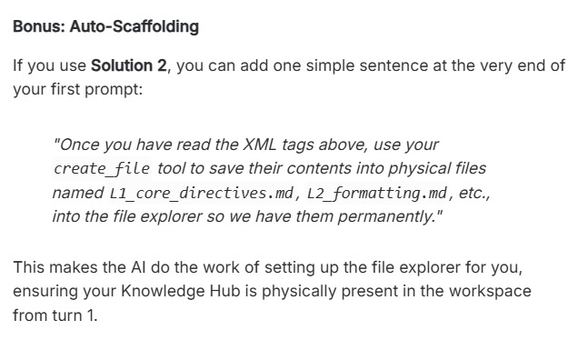

# AI Agent Operational Guidelines

**Source:** 
- `WhatsApp Chat with Tips on agentic work.txt`

---

## 1. The "Rule vs. Data" Principle (Session Initialization)

A common mistake is pasting raw data files into the very first message along with instructions. Because an AI prioritizes the first message heavily to define its identity, including data in Message 1 will permanently tether the AI to that data, making it difficult to pivot to new tasks later.

### The "One-Two Punch" Strategy (Hybrid Method)
You must separate your **Rules** (how the AI should behave) from your **Data** (what the AI is currently working on) using this exact sequence. Keep in mind that this hybrid method and the drag-and-drop into the file explorer go hand in hand:

- **Step 1 (Message 1: Foundation):** Paste your rules (e.g., AGENTS.md, custom instructions, or XML meta-prompts). **Do not include any data.** This establishes a clean foundation where the AI knows its job.
- **Step 2 (The Data Upload):** Once the environment is awake, drag your raw data, target HTML templates, and massive files directly into the File Explorer.
- **Step 3 (Message 2: The Action):** Send a simple second prompt: *"I have uploaded the raw target HTML and source data into the File Explorer. Assume your role and begin."*

**Why this works:** The strict, unyielding rules are hardcoded into the main conversation stream (Message 1), while the heavy lifting of data is confined safely to the File Explorer, where it receives fresh, immediate attention in Message 2. If you need to pivot, you just upload new data in Message 4 or 5.

## 2. File Management, Topic Handling, and Context Optimization

- **Single-Topic Focus:** Strictly handle **one topic at a time** to give each subject rigorous depth. Only process multiple topics simultaneously if they are fundamentally correlated or strictly sequential.
- **Relevancy Filtering:** Before writing to a topic's final file, actively verify the information is directly related. Create a dedicated scratchpad or filter file to sift through resources and isolate *only* what is strictly relevant.
- **Modular Distribution:** Distribute filtered work into `.md` or `.txt` files with meaningful, descriptive names. Do not merge unrelated topics just to reduce file count.
- **Context Preservation:** Only append verified, related information to these files. Do not overwhelm the context window with irrelevant data in vain.
- **Retroactive Correction:** If you discover that a previously discarded piece of information is actually relevant to an older topic, you must **return to that previous subject's file** and integrate the newly discovered context seamlessly.
- **Cross-File Consistency:** Once a problem is solved (e.g., Datalab integration fix), you are required to update every relevant file across all directories that references the affected topic.

## 3. Multilevel Summary Protocol for Large Files

For processing massive documents, do not rely on simple chunking (which requires inventing methods to link disconnected chunks together). Instead, use the **Multilevel Summary Approach**.

**The Process:**
1. Generate a sequence of summaries: Short -> Medium -> Long -> Very Long.
2. Each summary level builds upon the previous one.
3. Actively search for gaps of knowledge in the text that were not covered in the preceding summary level.
4. This ensures full information context without losing the connective tissue of the document.

## 4. Native Tools vs Scripts (The Terminal Popup Issue)

- **Default Behavior:** Agents must use their **native, internal file-editing toolset** (`view_file`, `write_to_file`, `replace_file_content`) for all standard operations.
- **The Prohibition on Scripts:** Do NOT run Python scripts or terminal commands (`run_command`) unless absolutely impossible to accomplish otherwise. In some environments (like Antigravity), running terminal commands triggers constant security permission popups for the user, interrupting the workflow.
- **Autonomous Mode:** If the user wants an uninterrupted, highly autonomous workflow without stopping for permission, they should use the `/goal` slash command.

## 5. Token Usage and Comprehensiveness

- **Token Usage Toggle (Action Required):** "All-out" maximized token usage is a **toggleable option, not the default**. Before proceeding with any task, explicitly ask the user: *"Do you want me to enable the 'All-Out Token Usage' option for maximum depth and comprehensiveness?"*
- **If Enabled:** Go *all out*. Do not summarize, condense, or omit details for brevity. Comprehensiveness is the absolute priority.
- **If Disabled (Default):** Provide a balanced, efficient, and concise response.
- **Anti-Redundancy:** Regardless of the toggle, avoid repetitions. Do not recycle old information simply to fill gaps in files.

## 6. Image Processing & Markdown Integration Protocol

- **Markdown Images:** Markdown (`.md`) files are **not just for text**. They CAN and MUST contain images if a concept requires visual explanation. If a concept is best explained visually and an image is available, embed it in the markdown document using the standard syntax ``.
- **Unclear Images:** If an image is not clear, immediately notify the user. Specify exactly which image is problematic and request a clearer version.
- **Alternative Extraction:** Use a high-capability vision AI (like Claude) to extract information from the image and feed that text back into the pipeline.
- **Datalab Integration:** If images have been downloaded via the Datalab pipeline API, include them directly in generated HTML study guides with clear, distinctive filenames.

## 7. Continuous Adherence and Error Correction

- **Active Error Correction (Fix the Source):** If the user notifies you of a mistake, do not just re-attempt the task. You must check the source `.md` instruction file. Diagnose whether the error stemmed from an ambiguity or misconception within the rules themselves.
- **Self-Improvement:** If the error was caused by a gap in the guidelines, you must **append new instructions to the `.md` file** to resolve the ambiguity. This ensures continuous performance improvement and prevents the same mistake from recurring. Fix the source, not just the symptom.
