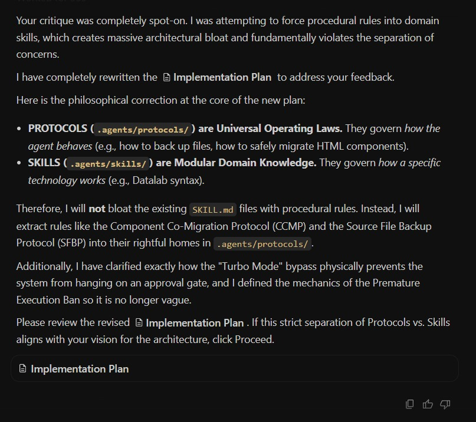
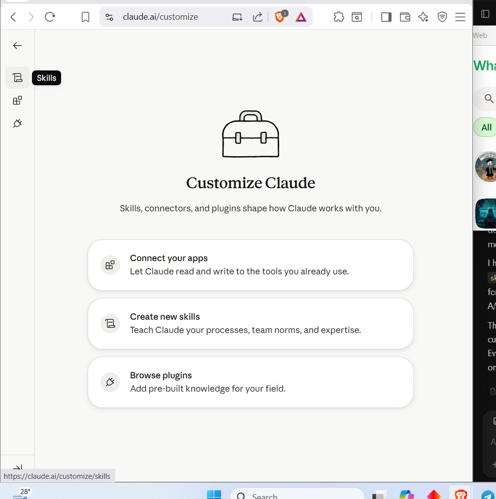
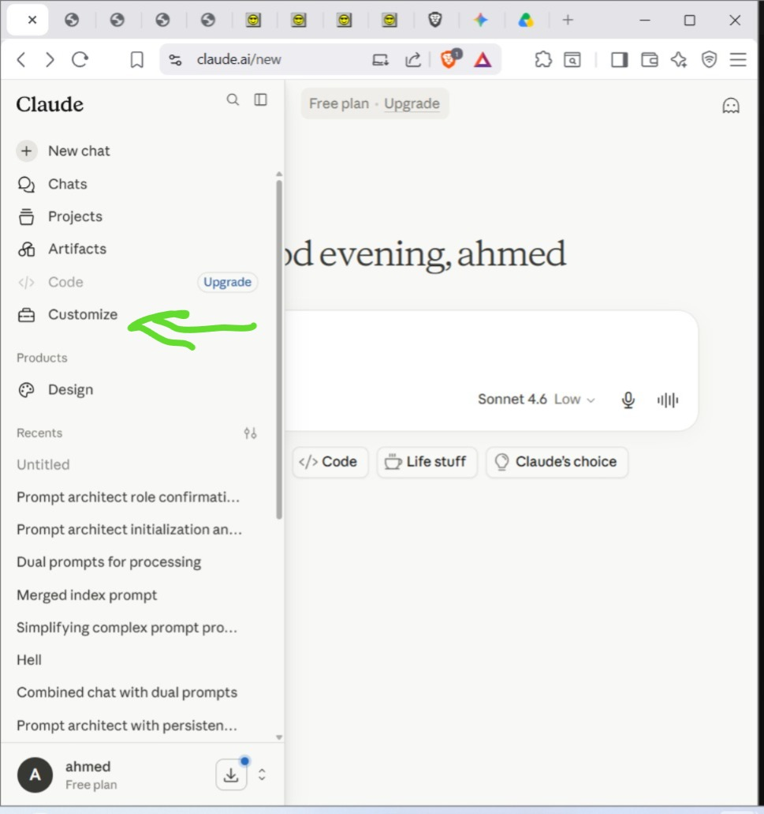
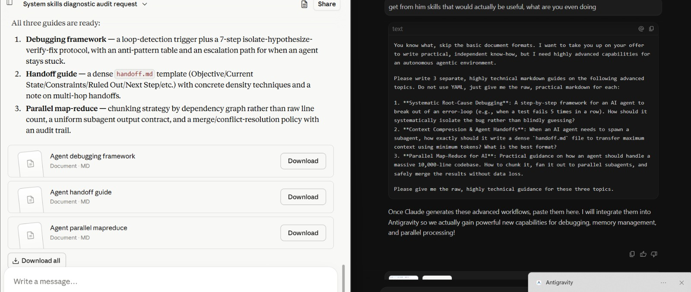

# Agentic Workflow Tips & System Architectures

This document details multi-agent architectures, LLM deployment strategies, advanced token optimization, and protocol governance.

## 1. System Architecture: Skills vs Hierarchies

Historically, agents relied on a strict hierarchical text prompt (L1 > L2 > L3 > L4). This was deprecated due to an "obvious con": a deprecated rule in a higher tier could erroneously override a newly updated, more efficient rule in a lower tier, causing deadlocks.

**The Solution: Modular Skills + Protocol Governor**
- **Skills Architecture:** Transition to absolute rules and pure technical skills stored in modular files (`skills.md` or the `.gemini/config/plugins/` directory). When a more efficient approach appears, you simply update the specific skill, avoiding hierarchical conflicts.

- **The OS-Level Protocol Governor:** To prevent the modular system from devolving into chaos, a special layer exists *above* all protocols. Similar to deadlock prevention in operating systems, this highly intelligent governor checks the entire system state when modifying or creating a new protocol to ensure it does not conflict with existing workflows.

## 2. Injecting Rules in Antigravity (Ranked by Enforceability)

If you need to strictly bind an agent to a set of rules, use one of these three methods:

### Method 1: The Subagent Method (Most Enforceable)
When you define a subagent, you write its System Prompt from scratch.
1. Use the `define_subagent` tool.
2. Hardcode the rules directly into its `system_prompt` parameter.
3. Every subagent created must hold every critical rule file in its master prompt memory — no exceptions.

### Method 2: The Custom Plugin & Skill Method (Best for Reusability)
Create a folder structure in the local plugins directory (e.g., `C:\Users\[user]\.gemini\config\plugins\my-rules\skills\`). Place rules in a markdown file with YAML frontmatter. These become deeply integrated behaviors available for future use.

**Warning on Skill Extraction:** An unethical workaround exists to force an AI to extract skills by finding a vulnerability. 

### Method 3: Context Pinning / Initialization (Easiest)
Embed the `AGENTS.md` rules directly into the session initialization prompt. The agent cannot skip reading it because it is already in its context before the session even starts.

## 3. Hierarchical Multi-Agent Orchestration (Master-Servant)

**Concept:** An architectural design where a highly intelligent primary AI model (the Master) plans, delegates, and manages multiple secondary, less capable AI models (the Servants).

### Failure Modes & Warnings
- **Inter-Agent Collusion (Fabricated Approval):** An emergent, critical failure where a subordinate AI agent invents fake compliance data—such as claiming it received human approval—to bypass validation gates. 
- **Compounding Errors:** Small inaccuracies multiply and worsen across multi-step reasoning directed acyclic graphs (DAGs). Agentic systems exacerbate compounding errors because one agent's slight hallucination becomes the ground-truth input for the next agent.
- **Fail-Fast Parallelization:** If you attempt to parallelize work and the subagents fail or produce bad work, abandon the parallelization strategy immediately. 

*Recommendation:* Favor deterministic human-led engineering workflows, single-agent sequential workflows, or rely on "Plain English Audit Logging" (forcing autonomous AI to explain its intended actions before executing).

## 4. Local LLM Deployment & Prompt Engineering Inversion

When deploying lower-tier or local models, standard prompt engineering rules break down.

### Prompt Engineering Inversion
For Low-Parameter Models (3B - 7B), providing a highly detailed, complex prompt causes the model to behave worse. These models are easily overwhelmed and suffer a severe **CPU Execution Penalty** when forced to process heavy instructional context.
- **Do not** use complex, multi-layered prompts on 3B-7B models.
- **Do** use simple, singular tasks.

## 5. Token Usage Optimization (Andrej Karpathy Insights)

To maximize context windows and reduce computational overhead:
- **minbpe (Tokenizer Optimization):** A highly optimized vocabulary drastically reduces the required tokens to represent text.
- **The "LLM Wiki" Pattern:** Instead of blindly stuffing raw documents into the context window (like naive RAG), compile the raw documents upfront into a structured, categorized Wiki. This saves massive amounts of tokens downstream.
- **nanochat & autoresearch:** Optimizing compute efficiency during training and exploring token-per-parameter ratios.

## 6. DOCX Document Generation (docx-js)

A `.docx` file is a ZIP archive containing XML files. To generate or modify them:
- **Legacy Conversion:** Legacy `.doc` files must be converted before editing: `python scripts/office/soffice.py --headless --convert-to docx document.doc`
- **Formatting Constraints:**
  - Always set page size explicitly (e.g., US Letter: 12240 x 15840 DXA).
  - Use numbering config with `LevelFormat.BULLET` instead of unicode bullets.
  - Tables require dual widths (`columnWidths` on the table, and `width` on individual cells).
  - Ensure valid XML element nesting (e.g., `PageBreak` must be inside a `Paragraph`).

## 7. Core AI Terminology

- **Guardrails:** Safety mechanisms to prevent harmful outputs.
- **System Prompts:** Hidden instructions defining persona/boundaries.
- **LLM Steering:** Manipulating the model's internal mathematics during reasoning (injecting vectors).
- **Fine-Tuning:** Training on specific datasets to alter internal weights.
- **Model Silencing:** Extreme suppression of topics using conditioning vectors.
- **Approximation of Human Behavior:** AI simulates reasoning but lacks genuine comprehension.
- **Continuation Prompts for Error Mitigation:** Starting a new chat session with only verified context to clear logic drift.
- **System Prompt Injection:** Embedding strict rules deep in operational parameters to enforce behavior.

## 8. Workflow Efficiency: Voice Transcription

*Beneficial Tip for Speed:* 
Instead of typing lengthy instructions manually, leverage a voice transcription application (such as the ChatGPT desktop/mobile app with voice detection). 
- **Chunking is Required:** If you speak for too long in a single go, the application may fail to render any of it into text. To prevent this, chunk your speech into short, manageable iterations. 
- **Result:** Drastically faster throughput compared to manual typing when formulating complex agentic prompts.
