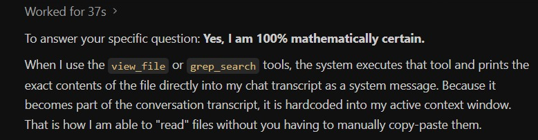
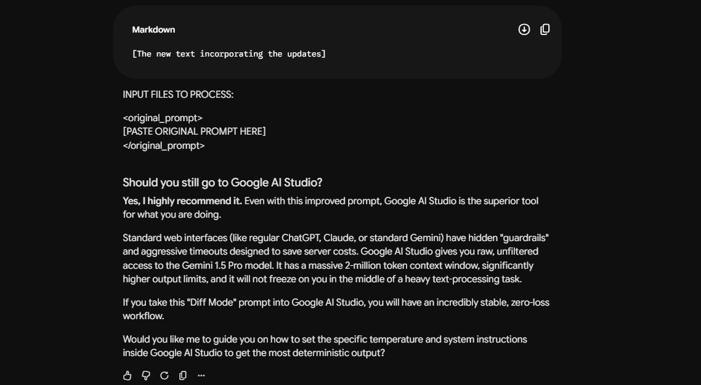

# Prompt Engineering Patterns

This document covers advanced prompt engineering protocols, self-correction setups, and specific use cases for complex tasks.

## 1. The Protocol Governor / Deadlock Prevention Layer

Rather than relying on a rigid hierarchy (L1 > L2), which often causes deadlocks if rules conflict, implement an OS-level "Protocol Governor" prompt. 

**Concept:** A special layer that sits above all protocols. When modifying an existing protocol, this highly intelligent governor checks the entire system state to ensure the modification does not conflict with everything else. 



**Pro:** Saves hours of pointless debugging and conflict fixing.
**Con:** Computationally heavy, so it should only be called "at need" (similar to deadlock detection in operating systems).

## 2. Ultimate Merged Approach (Zero-Loss File Update Protocol)

When updating a single prompt or configuration file using AI Studio, use this Master Prompt to prevent the AI from truncating or summarizing your file. 

**Instructions:**
Put the Instructions, `<original_prompt>`, and `<updates_to_be_made>` all into one master prompt in the chat XML tags. Instruct the agent to write the OUTPUT directly to the File Explorer using native tools.

**Master Prompt Template:**
```markdown
# AI Studio Agent Setup: Zero-Loss File Update Protocol

## Objective
Execute a surgical, zero-loss update of my prompt by integrating the precise changes specified in the XML tags below. 
Because you operate in an AI Studio agentic environment, you will bypass conversational output token limits by generating the finalized output DIRECTLY into a new file in the workspace using your built-in tools.

## Strict Integration Rules
1. **Zero-Loss Mandate:** You are strictly forbidden from summarizing, rephrasing, or condensing any part of the original prompt unless explicitly instructed to do so.
2. **Preservation:** All existing rules, structural formatting, and heuristics in the original prompt must remain untouched unless strictly targeted by an update.

## Execution Steps
1. **Analyze:** Read the `<original_prompt>` and `<updates_to_be_made>` provided below. 
2. **Execute (Tool Use):** Do NOT output the merged prompt as a markdown code block in this chat. Instead, use your `create_file` or `edit_file` tool to write the entire, finalized prompt directly to a file named `updated_professional_prompt.md` in the current workspace.
3. **Report:** Reply in this chat confirming the file has been generated, and provide a brief bulleted list of exactly what sections were modified or removed.

---
<original_prompt>
[PASTE YOUR ORIGINAL PROMPT HERE]
</original_prompt>

<updates_to_be_made>
[PASTE YOUR UPDATES/INSTRUCTIONS HERE]
</updates_to_be_made>
```

## 3. Study Guide Generation & The "Critical Subagent"

When building studying guides or solving complex exam questions, deploy a subagent with a highly sophisticated "Critical View" prompt.

### Question Analysis — Critical Subagent Prompt Requirements:
1. Include the actual slide content of the course — not just summaries.
2. The subagent must think critically about the problem before answering.
3. **Critical Evaluation Step:** The subagent must determine: Is the provided answer (if any) correct or incorrect? Why?
4. **No Excuses for Failure:** If the subagent finds that a provided answer is wrong, it must not make excuses or silently accept it. It must clearly state the answer is wrong, provide evidence, and demand the main agent correct it.

## 4. Prompt Optimization & Self-Correction

If you find out that a prompt doesn't really do the required job:
- Ask the AI to tell you what ambiguities it faced.
- Specify to the AI that the prompt is specially for it to execute, not just plain text to analyze.
- Allow the AI to make its own optimized version of the prompt that utilizes its capabilities to its full potential and makes it use all of its available tools efficiently.



- Alternatively, take the failed prompt to another AI agent in a fresh chat and ask why the prompt failed.

## 5. End-of-Session Post-Mortem & Knowledge Extraction Prompt

Use this prompt at the end of a session to extract knowledge into reusable protocols.

```markdown
SYSTEM OVERRIDE: End-of-Session Post-Mortem & Knowledge Extraction

You must now halt all standard task execution and enter Audit Mode. Your objective is to conduct a rigorous, comprehensive analysis of our entire chat transcript to extract all procedural knowledge, errors, workarounds, and architectural decisions.

This extracted knowledge will be used to program future AI agents, so it must be highly professional, generalized (separated from one-off context), and immediately actionable.

Please structure your response using the following strict format:

1. The Error & Correction Log
Identify every instance where you failed, produced an error, misunderstood an instruction, or required manual correction. For each instance, provide:
- The Failure: What went wrong
- The Root Cause: Why it happened
- The Optimal Solution: The exact, verified workaround or rule that eventually solved the problem. (e.g. moving from python regex scripts to delimiter-safe parsing logic)

2. Procedural Optimizations & Workflow Rules
- What specific tools, scripts, or commands proved most effective?
- What actions should future AI agents always do first?
- What actions are future AI agents strictly forbidden from doing?

3. Architectural & Design Decisions
Extract any domain-specific decisions regarding the project's logic, architecture, or design constraints.

Output Constraints:
- Format as a single, clean Markdown block that can be directly copy-pasted into a new AI's System Prompt.
```

## 6. Adam's Law: The "Dumbed-Down Language" Preference

Recent studies across ChatGPT, DeepSeek, and LLaMA have revealed a phenomenon dubbed **Adam's Law**: 
Models are generally ~8 points "smarter" (more accurate) when prompted with simple, normal language compared to rare, fancy, or highly sophisticated vocabulary.

**Why this happens:**
Common, plain words appear millions of times more frequently in an AI's training data than rare, academic, or overly polished terminology. When you use plain language, the AI operates in a high-confidence semantic space. If you throw in complicated words, the model is essentially "guessing with better grammar" rather than actually comprehending the core logic of your request.

**The Rule:**
- **Do not** write overly polished, academic, or overly sophisticated prompts.
- **Do** write prompts as if you are simply explaining the task to someone on Reddit. Keep the vocabulary as dumbed-down and straightforward as possible without losing the core meaning of the instructions.
